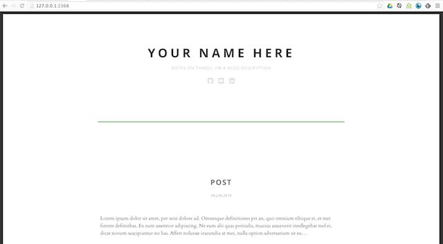

##Biscuit - a Ghost Theme

###Features
Biscuit is a modern/minimal theme for the Ghost blogging platform. Originally a port from the barebones Pliny theme, Biscuit includes:

* Responsive grid system, with Neat
* Bourbon/Bitters
* Highlights.js - for code syntax highlighting
* FontAwesome social icons

### Dependencies

Biscuit requires:

* [node/npm](http://nodejs.org/)
* Grunt: `npm install -g grunt-cli`
* Sass/Scss: `gem install sass`

### Getting Started

1. Clone the repo into your Ghost `themes` directory `git clone git@github.com:james89/Biscuit.git`
2. `cd` into the directory and run `npm install`
3. Run `grunt watch` to keep an eye on your Sass and JavaScript files

### To do
* Further styling for images, lists
* Disqus commenting system
* Footer styling
